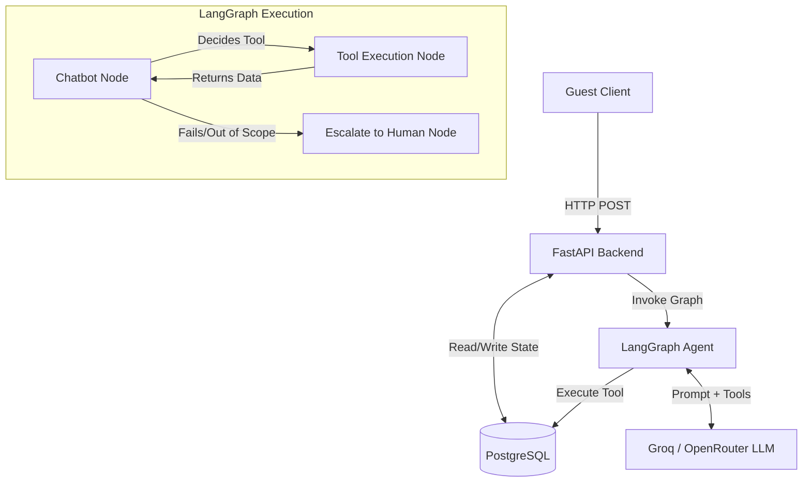

# StayEase AI Agent

## 1.1 System Overview
The StayEase AI agent is a state-driven orchestration service built with LangGraph and FastAPI. The system receives guest messages via the FastAPI backend, which retrieves the conversation state from a PostgreSQL database. The LangGraph agent processes the state using a Groq/OpenRouter LLM, dynamically invoking tools to search listings, fetch details, or create bookings in PostgreSQL. The updated state is persisted, and the response is returned to the client. If an intent is out-of-scope, the agent gracefully routes the state to human escalation.



## 1.2 Conversation Flow
**Scenario:** "I need a room in Cox's Bazar for 2 nights for 2 guests"

- Guest sends the message via the API.  
- API initializes LangGraph state.  
- LLM (Chatbot Node) recognizes the search intent but notes missing dates.  
- LLM responds: *"I'd love to help! What dates are you planning your stay in Cox's Bazar?"*  
- Guest replies: *"From Oct 10 to Oct 12."*  
- LLM invokes `search_available_properties` with extracted parameters.  
- Tool Node queries the database and returns available properties.  
- Chatbot Node formats the results with prices and returns them to the guest.  

## 1.3 LangGraph State Design

```python
class AgentState(TypedDict):
    messages: Annotated[list[BaseMessage], add_messages]  # Stores the conversation history.
    escalate_to_human: bool  # Flag to safely route off-topic queries to human agents.
```

## 1.4 Node Design

- **chatbot_node**: Evaluates conversation, calls LLM. Updates messages. Routes to tools, escalate, or END.  
- **tools_node**: Executes Python functions (DB queries). Updates messages with tool results. Routes back to chatbot_node.  
- **escalate_node**: Handles out-of-scope requests. Sets `escalate_to_human = True`. Routes to END.  

## 1.5 Tool Definitions

- **search_available_properties**  
  - Input: `location (str), check_in (str), check_out (str), guests (int)`  
  - Output: List of properties  
  - Use: When guest searches for options  

- **get_listing_details**  
  - Input: `property_id (int)`  
  - Output: Amenities / rules  
  - Use: When guest asks about a specific property  

- **create_booking**  
  - Input: `property_id, check_in, check_out, guests`  
  - Output: Booking reference  
  - Use: ONLY when a guest explicitly confirms booking  

## 1.6 Database Schema (PostgreSQL)

- **listings**  
  - `id (SERIAL PK)`  
  - `name (VARCHAR)`  
  - `location (VARCHAR)`  
  - `price_per_night_bdt (NUMERIC)`  
  - `max_guests (INT)`  
  - `description (TEXT)`  
  - `amenities (JSONB)`  

- **conversations**  
  - `id (UUID PK)`  
  - `guest_id (VARCHAR)`  
  - `status (VARCHAR)`  
  - `history (JSONB)`  
  - `created_at (TIMESTAMP)`  

- **bookings**  
  - `id (SERIAL PK)`  
  - `conversation_id (UUID FK)`  
  - `listing_id (INT FK)`  
  - `check_in (DATE)`  
  - `check_out (DATE)`  
  - `guests (INT)`  
  - `total_price_bdt (NUMERIC)`  
  - `status (VARCHAR)`  